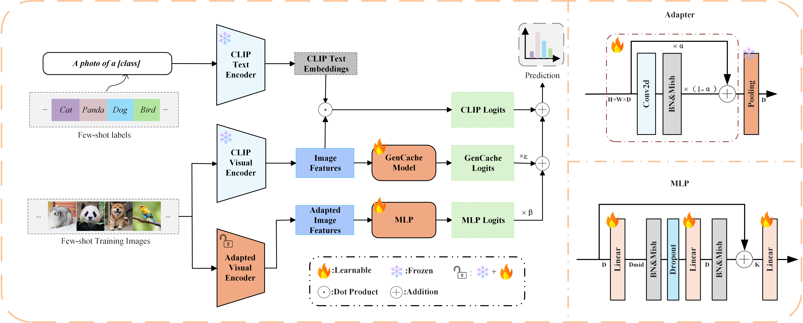

# MIF: Multi-Source Information Fusion for Few-Shot Classification with CLIP

Official implementation of "MIF: Multi-Source Information Fusion for Few-Shot Classification with CLIP".

## Introduction

This repository contains the implementation of MIF (Multi-source Information Fusion), 
a novel approach to enhance the adaptability and generalization of the CLIP model for few-shot classification tasks. 
MIF integrates multiple techniques to optimize visual feature representation, improving performance on few-shot classification across diverse datasets.

- ramework of MIF. 


<div align="center">
  
</div>


## Requirements
### Installation
Create a conda environment and install dependencies:
```bash
https://github.com/HaoYuan1001/MIF.git

cd MIF

# conda create -n MIF python=3.8
# conda activate MIF
# for torch version, we use 2.0.0+cu117

pip install -r requirements.txt
```

### Dataset
Follow [DATASET.md](./doc/DATASET.md) to install ImageNet and other 11 datasets referring to [CoOp](https://github.com/KaiyangZhou/CoOp).
Please download **DALL-E's** generated images from [here](https://drive.google.com/drive/folders/1e249OgUFCmpfEDPsxCVR-nNb6Q1VaZVW?usp=sharing), and organize them with the official datasets like
## Get Started
### Configs
The running configurations can be modified in `configs/dataset.yaml`, including shot numbers, visual encoders, and hyperparamters. And you can also change more arguments in the scripts under the [folder](./scripts/).

### Running
For ImageNet dataset:
```bash
bash ./scripts/train_imagenet.sh
```
We do the evaluation automatically at the end of training. If you want to evaluate seperately, you can also run:
```bash
bash ./scripts/test_imagenet.sh
```
For other 10 datasets:
```bash
bash ./scripts/train_other_datasets.sh
```

## Acknowledgement
This repo benefits from [CLIP](https://github.com/openai/CLIP), [CoOp](https://github.com/KaiyangZhou/CoOp),[Tip-Adapter](https://github.com/gaopengcuhk/Tip-Adapter),[FAR](https://github.com/WideStars/FAR/) and [CaFo](https://github.com/OpenGVLab/CaFo) . Thanks for their wonderful works.
